# 沉思往事立残阳，当时只道是寻常

---

## 开机

TouchBar右侧按钮

## 关机、重启、睡眠

左上角苹果图标

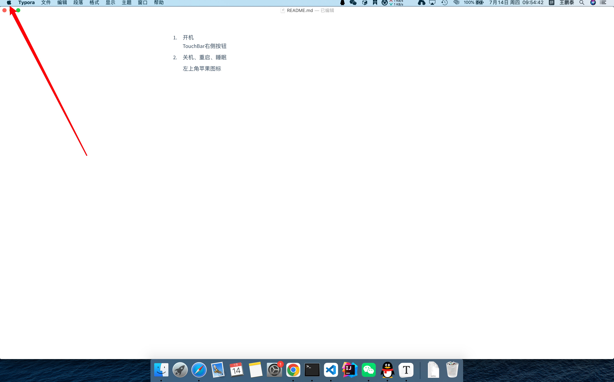

所有需要的操作都在这里

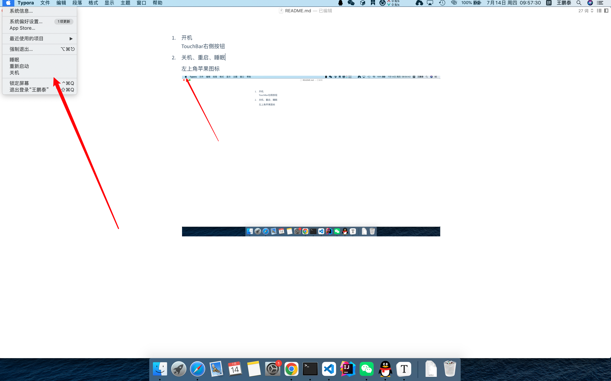

## 安装软件

Mac有四种方式安装软件

- 从AppStore应用商店安装

  点击屏幕下方Docker中的启动台（不同的系统版本这个图标可能不一样，最新系统版本应该是一个九宫格的彩色方块），找到AppStore打开，搜索软件（这里面软件比较少）

  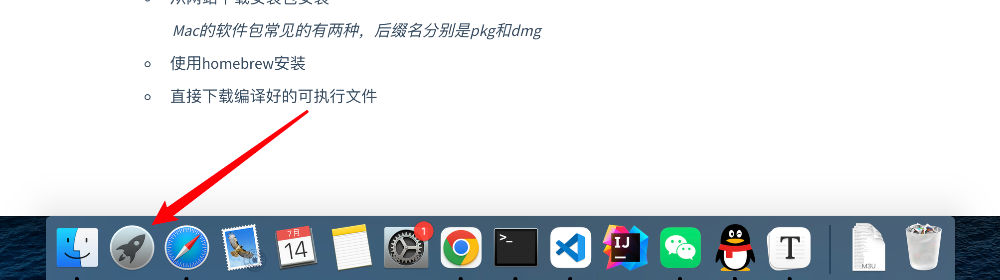

  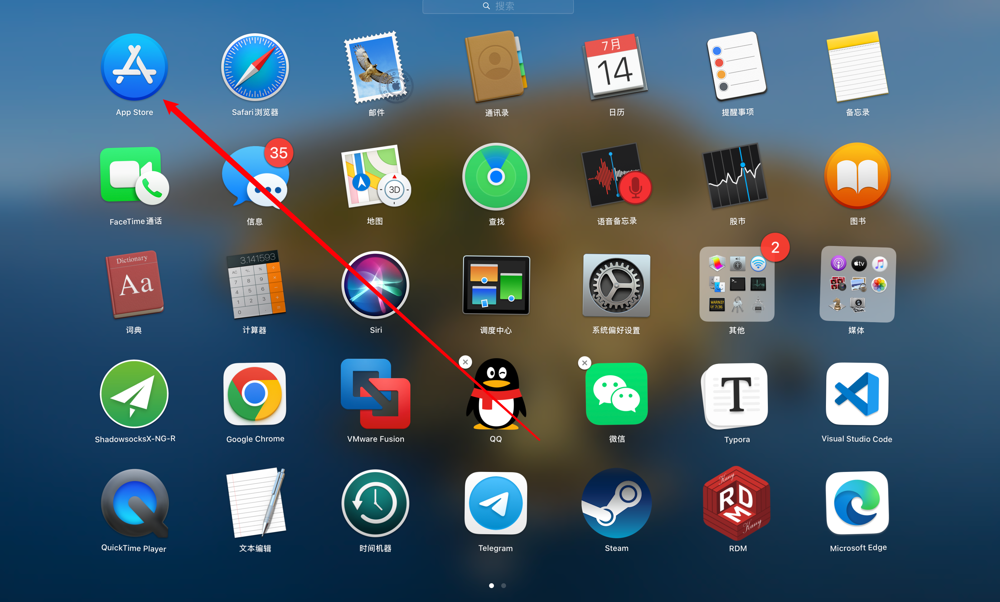

  

- 从网站下载安装包安装

  *Mac的软件包常见的有两种，后缀名分别是pkg和dmg*

  下载下来的安装包一般默认在“下载”文件夹里面，有两个地方可以找到

  1. Docker中，废纸篓左侧的图标

     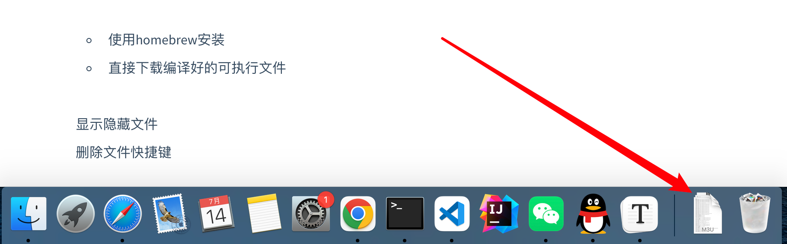

     

     

     点击即可展开刚下载的文件列表（展开列表的样式可以在图标上右键选择）

     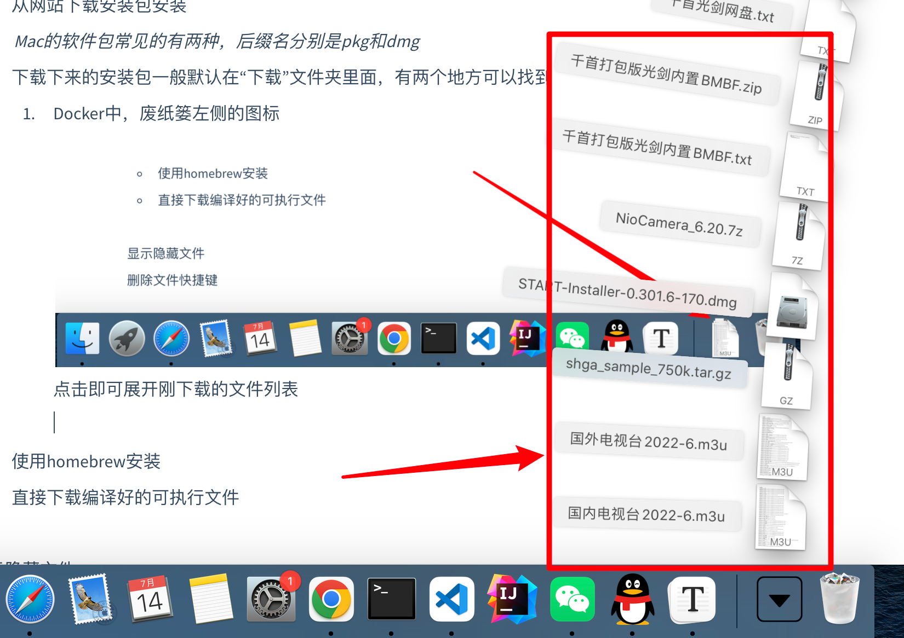

     

  2. 在访达中查看下载

     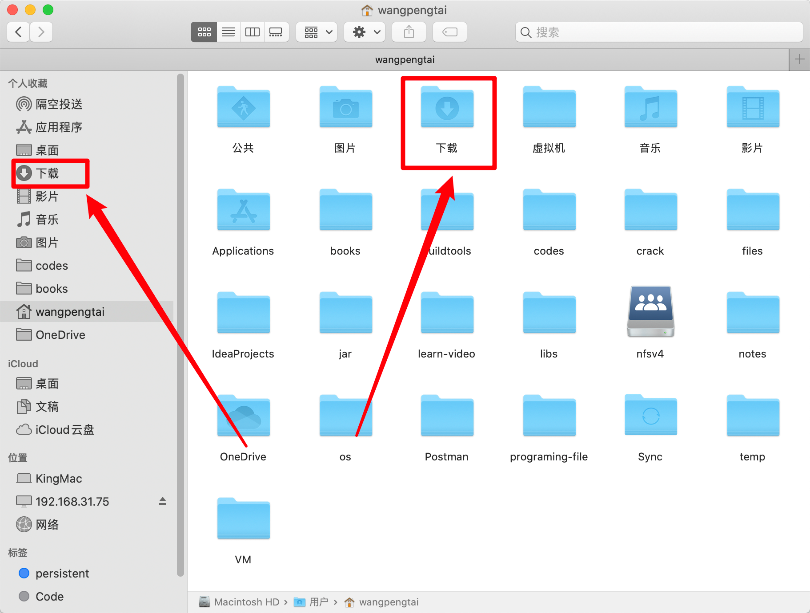

     

  dmg安装方法：双击打开下载后的安装包，根据提示，拖动左侧应用图标到右侧图标上面，然后松手即可完成安装，等到安装完成后，在应用列表中可以找到

  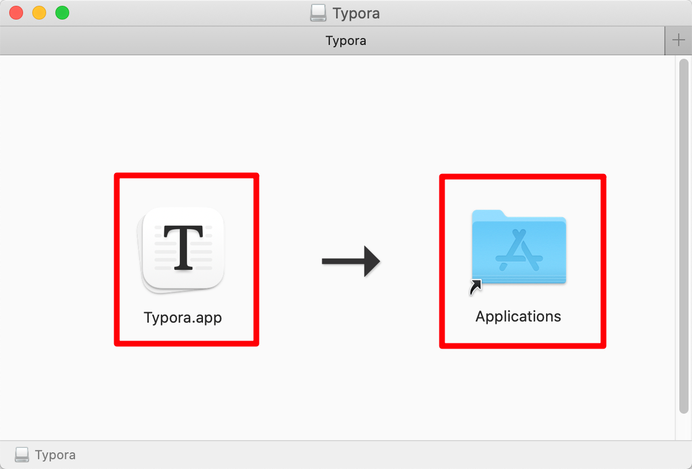

  

  pkg安装方法：双击打开安装包，根据提示选择路径，按需输入密码完成安装（跟Windows安装相似）

  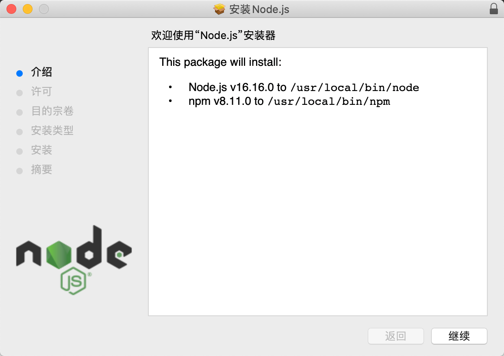

  

- 使用homebrew安装

  首先安装homebrew，地址在：https://brew.sh/

  在网站上点击按钮复制安装命令

  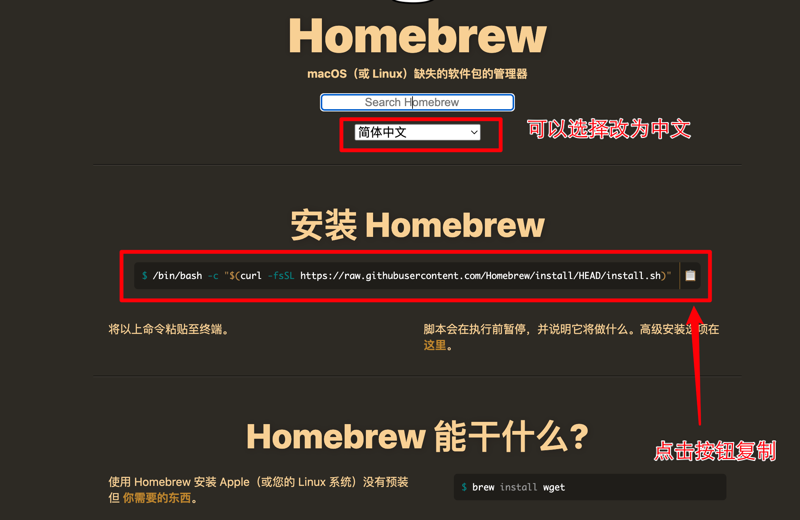

  

  从启动台找到“终端”，并 点击打开

  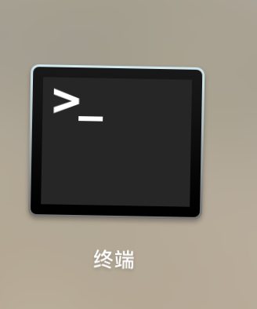

  

  使用鼠标右键粘贴，或者按键`Command+V`粘贴刚才复制的命令，回车执行

  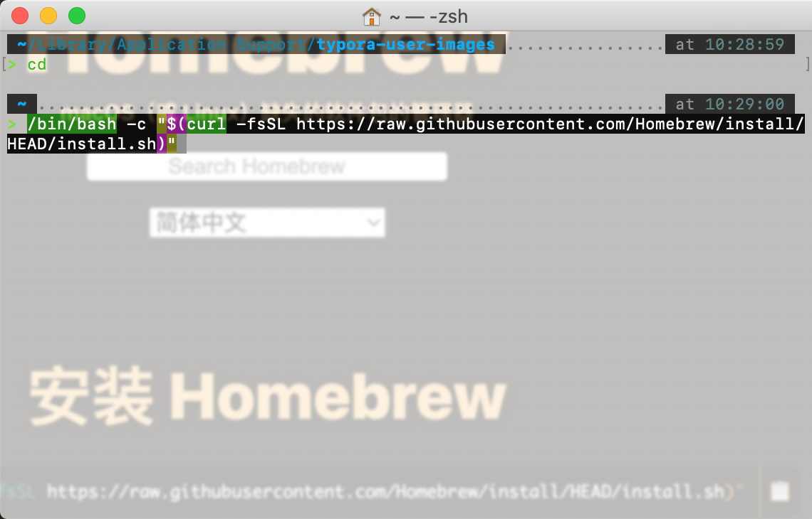

  

  等待homebrew安装完成后，输入`brew install XXX`安装需要的软件，以安装git为例

  输入`brew install git`，等待执行完，git就安装好了，其他软件也可以类似安装。

  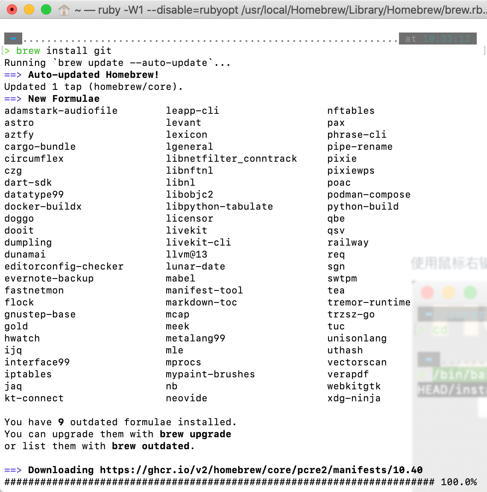

  

- 直接下载编译好的可执行文件

  一般会给tar.gz的压缩包，直接在下载里面双击打开压缩包就可以，Mac可以自动解压压缩包到同名文件夹中，可执行文件比较特殊，需要以命令行执行。

  如果解压出来是后缀为.app的格式，则可以双击运行。

## 显示隐藏文件

在Mac中隐藏文件以英文字符的句号`.`为开头命名，默认隐藏，需要显示的话

1. 在访达中显示隐藏文件，同时按下`Command+Shift+.`显示隐藏文件，再按一下隐藏

   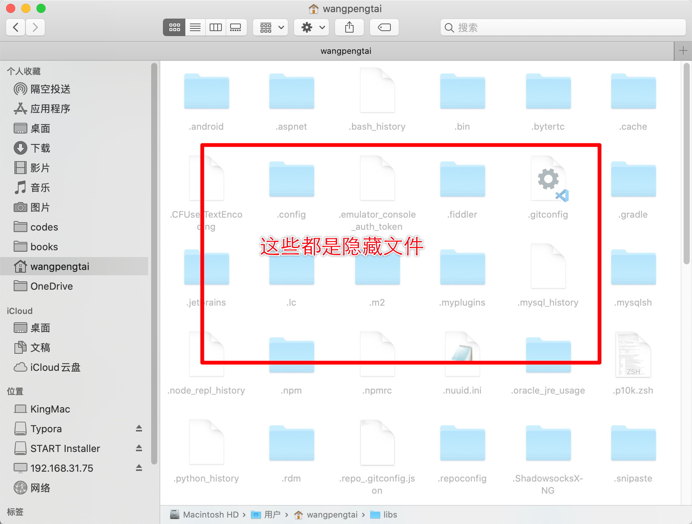

   

2. 在 终端中显示隐藏文件，输入`ls -a`能够显示出所有的文件，包括隐藏文件

   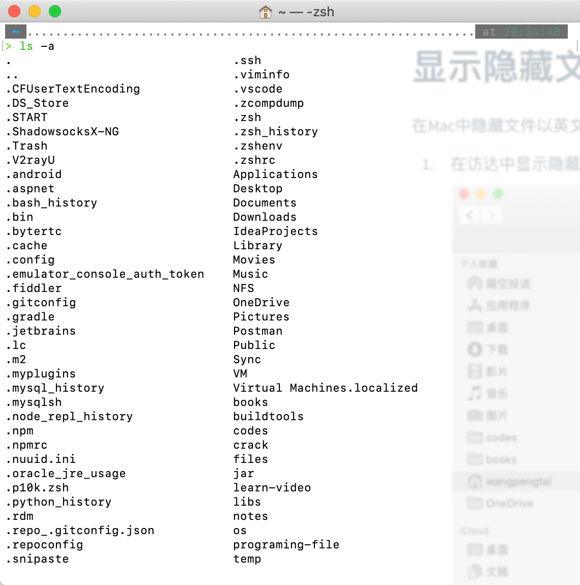

   

## 删除文件快捷键

在访达中删除文件，除了用鼠标以外还可以使用键盘快速操作，选中文件，然后同时按下`Command+BackSpace`,BackSpace键就是删除字符的按键。

## 终端

终端的使用和前面学的Centos Linux使用时一样的

## 多功能键

Touch Bar默认不会显示多功能键（F1-F12），需要按下键盘左下角的Fn键，然后Touch Bar会显示多功能键。

## 切换桌面

Mac中全屏以后，应用窗口会在新的桌面中打开，这个时候如果想切换到其他程序，可以

1. 用`Command+Tab`选中要切换的其他程序
2. 按下`control+⤒`选择需要的应用窗口或者桌面
3. 按下`control+⟵/⟶`切换桌面
